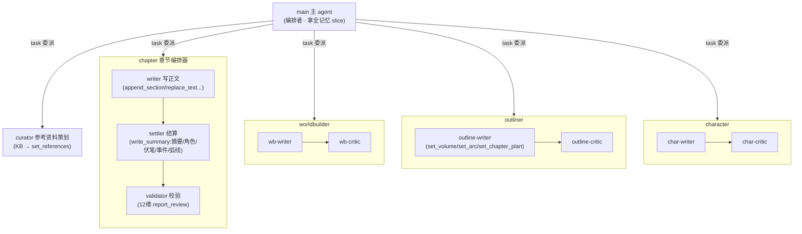
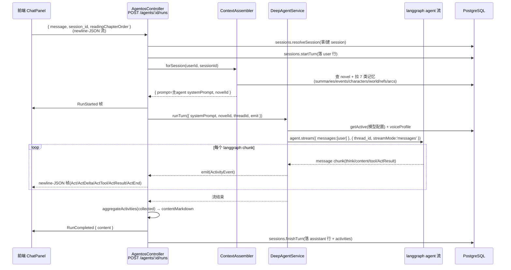
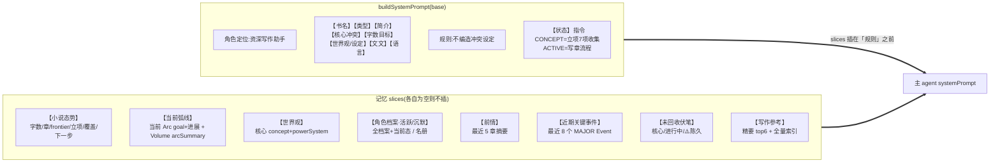
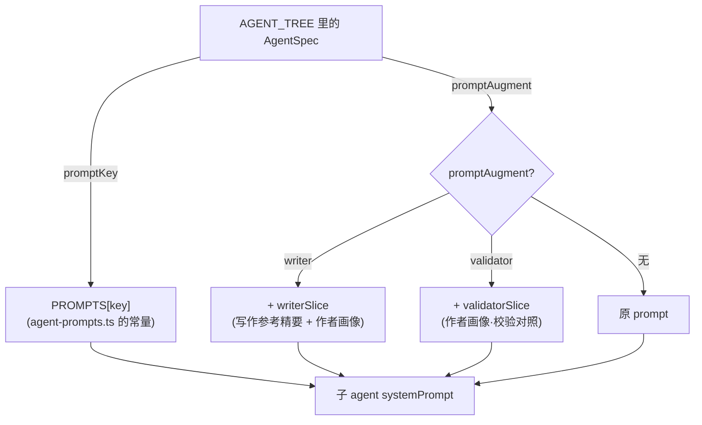
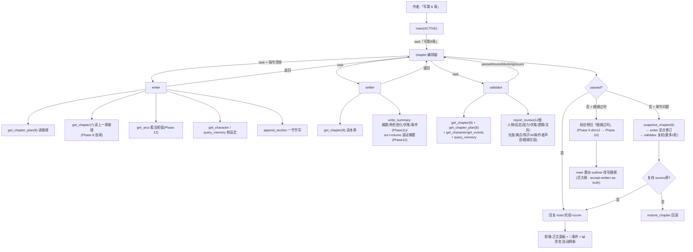
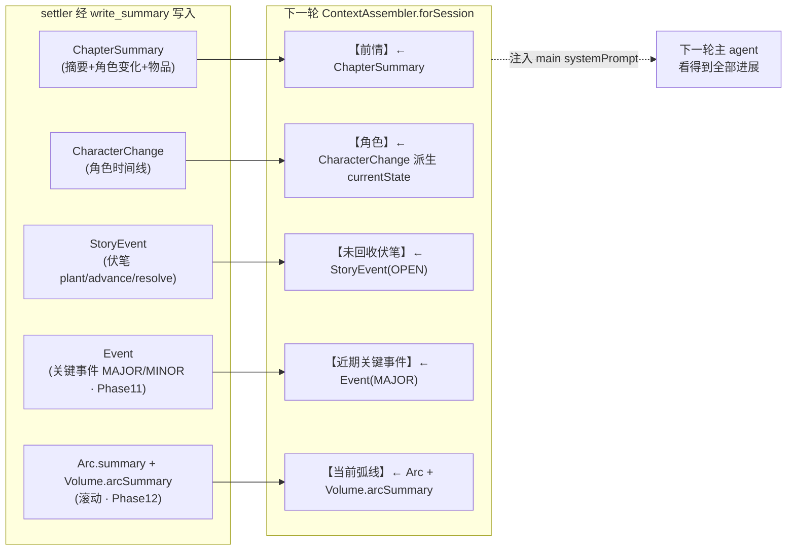
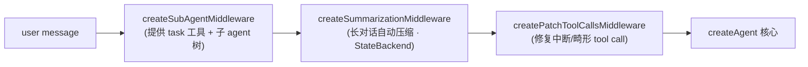
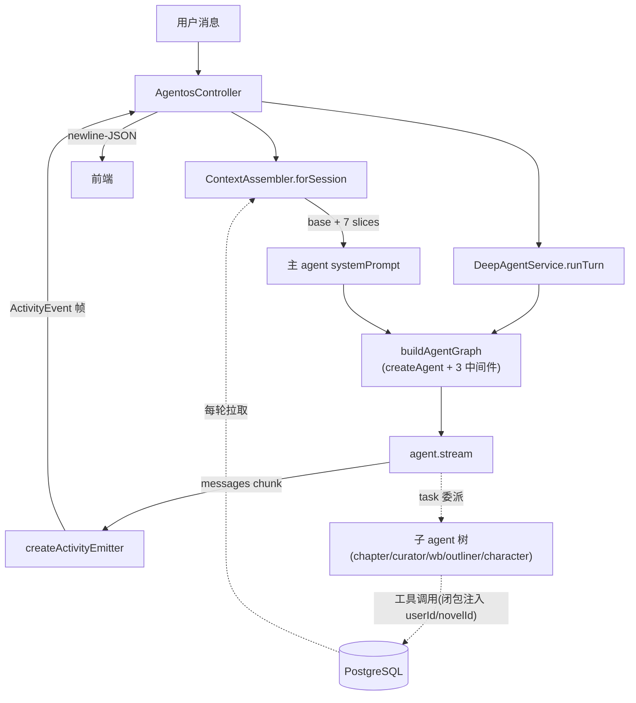

# 写一本小说:提示词组装与全流程流转

> 架构文档 · 2026-06-27 · 覆盖 Phase 5-12 后的当前状态(agent-tree / context-assembler / deep-agent.service 实测核对)
>
> 阅读建议:VSCode 打开本文档,mermaid 图在 markdown 预览里渲染。

## 0. 一句话总览

用户在工作台发一条消息 → `POST /agents/:id/runs` → **ContextAssembler 把小说的全部「记忆」拼成主 agent 的 system prompt** → deepagents 的 `createAgent` 建出一棵 agent 树(main + 5 个 task 委派编排器)→ 主 agent 按状态(立项 / 写作)委派子 agent 跑流水线(写章 = writer → settler → validator + 修订)→ langgraph 流被压成**扁平活动帧** newline-JSON 推给前端 → settler 把本轮事实(摘要/角色/伏笔/事件/弧线)写回 DB → **下一轮 ContextAssembler 再注入**,形成记忆闭环。

**核心心智模型(最重要,先记住)**:
> **主 agent 上下文 = 被动注入的全书记忆(8 个 slice);子 agent 上下文 = 自己的职能 prompt + 按需用工具主动拉取。** 主 agent 「总能在背景里看到」态势/设定/角色/前情/事件/弧线/伏笔;writer/settler/validator 看不到这些 slice,它们用 `get_chapter_plan`/`get_character`/`get_events`/`get_arcs`/`query_memory` 等工具**主动查**。这是 Phase 6/7 审视后确立的分工。

---

## 1. Agent 树(谁负责什么)



- **main**:状态感知(CONCEPT 立项 / ACTIVE 写作),只编排,不直接写正文/设定/大纲——一律 `task` 委派。
- **chapter 编排器**:聚焦上下文里跑完一章 writer → settler → validator(+ 最多 1 轮修订)。
- 每个 writer→critic 对都是「取 KB 方法论 → 生成 → 评审 → 定点修订」的镜像结构。

---

## 2. 从用户消息到 agent run(入口流转)



- **thread_id = sessionId** = langgraph 的 `Session.id`;checkpointer(PostgresSaver,`agent_memory` schema)持久化对话状态,跨轮续接。
- **断连**:`req.on('close')` → `AbortController.abort()` 停掉 LLM/工具。
- **错误轮次也落库**(`isError=true`)供回显;`finally` 里 best-effort 持久化。

---

## 3. 提示词组装(本文核心)

### 3.1 主 agent 的 system prompt(ContextAssembler.forSession)



**base 的状态分支是关键**:
- **CONCEPT(立项中)**:指令是「收集 7 项基础信息 → 委派 curator → 建世界观 → 规划大纲(含分弧)→ 建角色 → 才写正文」。
- **ACTIVE(写作中)**:指令是「写/续写/重写时委派 chapter agent 跑 writer→settler→validator;细纲过时则委派 outliner 改写(Phase 10)」。

**slice 数据源**(全部 user-scoped,`novel: { userId }`):

| slice | 来源 | 作用 |
|---|---|---|
| 当前弧线 | `ArcService.findArcByChapter(currentChapter)` + 其 Volume | 写章时知道「在哪条弧、本卷/本弧进展」(Phase 12) |
| 世界观 | `WorldEntryService.listCore`(concept+powerSystem) | 核心设定常驻 |
| 角色 | `CharacterService.listForContext`(分层:活跃全档案+当前态 / 沉默名册) | 长篇不丢角色(Phase 6) |
| 前情 | `SummaryService.listRecent(5)` | 最近 5 章情节 |
| 近期关键事件 | `EventService.listRecentMajor(8)` | 突破 5 章窗口的关键情节(Phase 11) |
| 未回收伏笔 | `StoryEventService.listOpen`(带 stale 计算) | 哪些承诺待兑现 |
| 写作参考 | `NovelReferenceService.listAll`(curator 固化的精要) | 本书专属方法论 |

> `currentChapter` = `Chapter` 表最大 `order`(决定当前弧、角色活跃窗口、伏笔陈旧)。

### 3.2 子 agent 的 system prompt(不一样!)

子 agent **不继承** main 的 slice,各自用声明式配置:



- `resolvePrompt(spec)`:`PROMPTS[spec.promptKey]` + (writer 拼 `writerSlice` / validator 拼 `validatorSlice`)。
- **writerSlice / validatorSlice 在 runTurn 里现拼**(每轮):参考资料(injectTo=writer/both 的 top6 精要)+ 作者画像。空则不加,行为不变。
- **子 agent 看不到【世界观/角色/前情/事件/弧线/伏笔】这些 slice**——靠工具主动拉(writer 写前 `get_chapter_plan(N)`/`get_arcs`/`get_character`,validator 审时 `get_chapter_plan`/`get_character`/`get_events`,settler 结算时 `get_chapter`)。**这是审计/聚焦场景的有意设计**:子 agent 上下文不被全书记忆稀释,只拉它这步需要的。

### 3.3 模型与工具的解析

- **model**:`resolveModel(spec, activeConfig)` → `resolveModelConfig`(按 spec.temperature 覆盖)→ `getModel`(buildChatModel 路由 provider:openai-compatible / anthropic / gemini;按 `modelTier` 定 maxTokens:long=16k / short=6k;按 `${id}:${maxTokens}:${temp}` 缓存)。**每用户配置,非硬编码**。
- **tools**:`resolveTools(spec.tools)` → `TOOL_REGISTRY[key](deps)`(工厂闭包注入 `userId`/`novelId`——**永远不来自 LLM 输入**,防越权)。

---

## 4. 写一章的完整子流程(最常走的路径)



**关键关卡(都在 ChapterService,事前拦截而非事后)**:
- `assertHasPlan`:writer 永不写没有细纲的章(逼 main 先委派 outliner 补/改细纲)。
- `assertFrontier`:前驱章必须已结算(逼按序写、防跳章丢记忆)。
- 写入后 `ChapterOutline.status → WRITTEN`(单向往状态标记,非对账)。

---

## 5. 记忆闭环(setter 写 → 下一轮注入)



**settler 是唯一记账员**——所有持久化记忆都经它的 `write_summary` 工具。它是单点依赖:漏提一个伏笔/事件,后续轮就丢(已知风险,Phase 8 审视标注)。

---

## 6. 流式输出协议(newline-JSON)

langgraph 的 `messages` 流被 `createActivityEmitter` 压成**扁平活动帧**,controller 每帧即时 flush(不缓冲):

```
RunStarted                                          ← 包头
Act(id=content) ActDelta... ActEnd                  ← 主 agent 的回复/正文
Act(id=tool:write_chapter) ActTool ActResult ActEnd ← 工具调用
Act(id=think) ActDelta... ActEnd                    ← 子 agent 推理(writer/settler/validator)
...
RunCompleted { content: contentMarkdown }           ← 包尾(聚合后的交错文档)
```

- `contentMarkdown` 含 `::think`/`::tool`/`::stage` 标记,落 `Message.content` 供刷新时重建交错文档。
- `streamTransformers: [createSubagentTransformer]` 把子 agent 的内部流也展平进同一条流。
- 前端 `useAIStreamHandler` 解析这些帧 → 构建 `store.messages`;`activity-aggregator` 在服务端做对称聚合。

---

## 7. 中间件栈(主 agent)



- **无 filesystem 中间件**(故意用 `createAgent` 而非 `createDeepAgent`,避免它注入 write_file/read_file/execute)。子 agent 公用栈更精简:仅 `createPatchToolCallsMiddleware`。
- **summarization 只压 thread message 历史**,不碰 DB 记忆——DB 记忆(settler 写的)与 thread 压缩正交,跨 session 持久。
- `recursionLimit: 10_000`(深委派不限死)。

---

## 8. 关键设计点 & 已知边界

**设计点**:
1. **main 被动注入 vs 子 agent 主动拉取** 的分工(§3)——审计/聚焦场景按需拉取更准、更省上下文。
2. **声明式 agent 树**(`AGENT_TREE` + `TOOL_REGISTRY` + `PROMPTS` + `resolveModelConfig`)——加 agent = 加配置,不改 `deep-agent.service`。
3. **userId/novelId 闭包注入工具**——模型无法寻址他人小说/章节(多租户隔离)。
4. **DB 记忆 vs thread 记忆分离**——settler 显式持久化 vs langgraph 自动压缩;前者可检索,后者临时。

**已知边界 / 未验证**:
- **整条多 agent 委派链未活体 E2E**(settler 是否稳定提取事件、validator 是否真调 dim12、Phase 10 改写是否真触发)——Phase 5-12 全为理论加固。
- **settler 单点依赖**:漏提即永久丢;无提取质量校验。
- **query_memory 是关键词 contains**(无向量召回)——Phase 8 审视标注的终局解待做。
- **【作者画像】slice 拼给 writer + validator**(centaur 校验),其它子 agent 不含。
- **checkpointer 在 `agent_memory` schema**(Prisma 只管 `public`)——`prisma migrate dev` 不会动它,保持 drift-free。

---

## 附:一图全览


